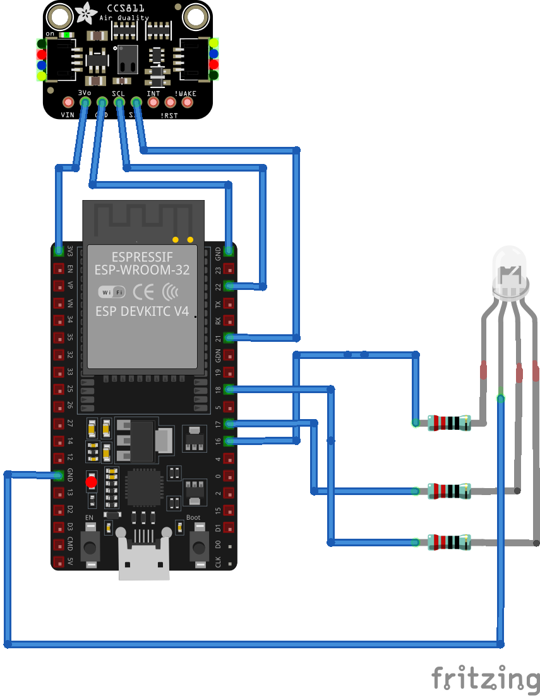

# README

## parts

- SCC-811 sensor
- ESP32 Dev Kit
- RGB LED
- 3 resistors with 15 Ohm
- Breadboard
- Jumper cable

## wiring

- ESP-32 to SCC-811
	- GND -> GND
	- GND -> WAK
	- 3V  -> VCC
	- SCL -> 22
	- SDA -> 21
- ESP-32 to RGB LED
	- 16 -> restistor -> red
	- 17 -> resistor -> green
	- 18 -> resistor -> blue
	- GND -> ground

